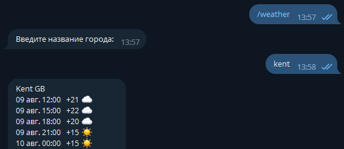
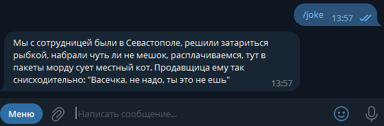
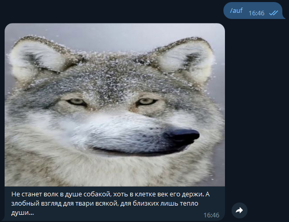

## Welcome to my first bot project.

The theme of the project is a weather bot with a bit of humor.

#### What can the bot do? (update 30.09.2023)

1. give a weather forecast by geolocation (for mobile telegram-client)
2. give a weather forecast for any city transmitted from the chat (on english lang)
3. give a random joke from the башорг.рф
4. make auf! over 1000 auf-phrases + ten images

#### Examples:

Forecast for city - Kent: 
 
Random joke from башорг.рф: 
 
Random auf phrase: 
 

#### List of supported commands:

    /start
    /joke
    /weather
    /auf

#### List of used libraries (update 09.08.2023):

1. ~~telegram bots - library to create telegram bots~~
2. ~~telegram bots extensions - extensions bots for telegram bots library~~
3. ~~lombok - saves us from boilerplate code~~
4. ~~log4j - logger~~
5. slf4j(version: 2.0.7) - logger
6. kotlin-telegram-bot(version: 6.1.0) - a wrapper for the Telegram Bot API.
7. jackson(version: 2.15.2) - for working with json objects (weather API in my project)
8. gson(version: 2.9.0) - for convert a JSON string to an equivalent Kotlin object
9. jsoup(version: 1.16.1) - for parsing html sheets (jokes from башорг.рф)

You can use its services yourself if it is online - **@no_first_bot** his name.

If you want to use a bot with your token, run it with the parameters (bot_name bot_token appid(key
from https://openweathermap.org )).

(update 09.08.2023)
I didn't rent a server for a bot, but just used ~~raspberries~~ mini-PC iRU 114. This is my little
production server
from improvised means.